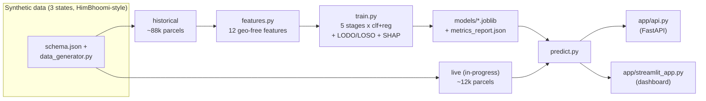

# SIH26017 — Predictive Analytics for Early Detection of Land Acquisition Delays

An AI-powered **early-warning system** that predicts which land-acquisition projects will
get delayed, *before* the delay happens — built for Ministry of Rural Development problem
statement **SIH26017** under the **RFCTLARR Act, 2013**.

For each parcel (rolled up to project → village → district → state) it outputs a **risk
score**, **per-stage delay probabilities**, **explainable contributing factors** (SHAP),
and **recommended corrective actions** — across a **pan-India, 3-state** pilot
(Himachal Pradesh, Punjab, Uttarakhand).

> ⚠️ Any collaborator/AI: read [`PROJECT_CONTEXT.md`](PROJECT_CONTEXT.md) first — it is the
> authoritative decision log.

---

## 1. Problem

Land acquisition is the most time-sensitive phase of infrastructure delivery. Delays stem
from many interacting causes — administrative approvals, legal disputes, compensation
disbursement, incomplete documentation, ownership conflicts, and rehabilitation &
resettlement. There is currently **no intelligent mechanism to flag a project *before* it
falls behind**, so monitoring is reactive.

## 2. Solution

A machine-learning pipeline that learns from **historical land records + RFCTLARR stage
timelines** to score risk per parcel:

- **5 legal stages** (SIA, Notification, Declaration, Award, Possession), each with a
  statutory clock. Delay = actual days − statutory days.
- **10 models** (5 stages × classifier + regressor) predict per-stage delay probability
  and days-overrun.
- **Region-agnostic by design** — models never see district/state names, so a brand-new
  region is scored instantly via feature similarity (cold-start).
- **Explainable** (SHAP) + **actionable** (rule-based recommendations).

## 3. Architecture



```
              ┌──────────────────────────────────────────────┐
              │  schema.json → data_generator.py (seeded)     │
              │  3 states · 48 districts · semantic IDs       │
              │  point + linear (corridor) projects           │
              └──────────────┬───────────────────────────────┘
                 historical (~88k)          live (~12k)
                        │                       │
                        ▼                       │
                 features.py (geo-free X)      │
                        │                       │
                 train.py (10 models, LODO/LOSO)│
                        │                       │
                 models/*.joblib ───────────────┼──┐
                                                ▼  │
                                       predict.py ◄┘
                                      ┌───────┴────────┐
                                      ▼                ▼
                                  app/api.py     app/streamlit_app.py
                                  (FastAPI)      (cascading filter, clickable
                                                  tables, project dashboard,
                                                  onboarding, what-if, alerts,
                                                  area-of-interest, map, roles)
```

## 4. Tech stack

Python 3.14 · pandas · NumPy · scikit-learn (HistGradientBoosting) · SHAP · Streamlit ·
Plotly (offline risk map) · FastAPI/uvicorn · joblib · parquet.

## 5. Results (current run — regenerate with `src/demo_numbers.py`)

Per-stage classifier AUROC, and cold-start drop at two levels (leave-one-**district**-out
across 48 districts, and leave-one-**state**-out across 3 states):

| Stage | AUROC | delay rate | LODO drop | LOSO drop |
|---|---|---|---|---|
| SIA | 0.772 | 70% | −7.0% | −6.0% |
| NOTIFICATION | 0.869 | 84% | −3.8% | −3.3% |
| DECLARATION | 0.915 | 92% | −1.3% | −1.4% |
| AWARD | 0.902 | 81% | −0.9% | −0.7% |
| POSSESSION | 0.907 | 81% | −1.6% | −1.2% |

- **Cold-start proof:** held out of training entirely, an unseen *state* is still predicted
  within a small believable band (**LOSO avg drop 2.5%**, per-state AUROC ~0.90) — the
  model generalizes by feature similarity, not by memorizing geography.
- **~29%** of in-progress stages are already past their statutory deadline
  (overrun-while-ongoing — the early-warning "money shot").
- Full metrics + both cold-start tables: `models/metrics_report.json`.

## 6. Setup & run

```bash
# one-command setup from a fresh clone (creates venv, installs, regenerates data+models)
bash scripts/bootstrap.sh --no-launch   # add no flag to also launch the dashboard

# or run pieces manually (with .venv activated)
.venv/bin/python src/data_generator.py        # 1. data (3 states, semantic IDs)
.venv/bin/python src/sanity_check.py          #    sanity
.venv/bin/python src/train.py                 # 2. models (+ LODO + LOSO + gates)
.venv/bin/python src/predict.py --refresh-portfolio   # 3. live portfolio cache
.venv/bin/streamlit run app/streamlit_app.py  # 4. dashboard (http://localhost:8501)
.venv/bin/uvicorn app.api:app --port 8000     #    API + BhoomiSetu landing (http://localhost:8000)
```

**BhoomiSetu front door:** run the API server and open `http://localhost:8000` — a polished
product landing page that links into the Streamlit dashboard at `http://localhost:8501`.

**Other entry points**

```bash
.venv/bin/python src/predict.py --json parcel.json         # score a parcel from JSON
.venv/bin/python src/demo_numbers.py                       # demo facts (auto-sourced)
.venv/bin/python src/e2e_test.py                           # end-to-end gate (incl. fresh clone)
```

The API contract is documented in [`INTERFACES.md`](INTERFACES.md).

## 7. Dashboard features

- **Portfolio** — cascading filter (State → District → Project type → Project + risk level);
  clickable project + parcel tables.
- **Project detail** — summary strip, per-stage bottleneck bars, segment (village) profile,
  paged parcel list.
- **Parcel detail** — per-stage probability bars vs statutory clocks, SHAP "why", actions.
- **New Project onboarding** — officials create a project and tag land parcels by uploading
  a CSV of semantic parcel IDs (records pulled automatically; unknown IDs rejected); instant
  scoring, persisted across refresh, tagged "user-created". Only sanctioning-time fields are
  entered (type, spatial type, affected families); compensation/rehab are lifecycle states
  tracked via the Project detail "Update project state" action, and responsiveness/track
  record are derived from the district, so risk-relevant inputs can't be gamed.
- **What-if** — toggle court stay / compensation → risk updates live.
- **Alerts** — auto-flagged parcels (overrun-while-ongoing, RED, court stay, compensation)
  + a simulated notification log (SMS/Email/Push).
- **Trends** — delay trends by state/district/project-type, per-stage delay probability,
  a district × stage heat map, and historical per-stage overrun.
- **Compare** — side-by-side comparative analytics for any two districts or projects.
- **Area of Interest** — pick a center village + radius → catchment risk profile.
- **Map** — point projects as markers, linear corridors as polylines, colored by risk.
- **Role switcher** (mock) — Admin / Officer / Viewer with functional gating.

## 8. Data & cold-start defense (the honest framing)

- Data is **synthetic** but mirrors real HimBhoomi schemas with **semantic IDs**
  (`<STATE>-<DISTRICT_CODE>-<VILLAGE_CODE>-<KHASRA_NO>`); delay rules encode documented
  ground realities (joint owners → consent delays; court stay → award freeze; orchard →
  compensation disputes).
- **Point vs linear** spatial realism: dams/industrial are localized; roads/rail are
  corridors routed through contiguous villages across district/state borders.
- Two **hidden confounds** (state + district administrative capacity) drive between-region
  variance and are only *partially* proxied by features — so cold-start is validated, not
  asserted, with a believable (not zero, not broken) drop.
- NIC/gov data access requires approval beyond student scope; the **architecture is
  production-ready** once access is granted ("plug in Bhoomi/Bhulekh data").

## 9. Limitations & future work

- `train.py --incremental` is a **refit-on-new-data** path (HistGradientBoosting has no
  true `partial_fit`) — it is *not* online learning.
- Role-based access is a **mock** (UI-only gating); real RBAC + audit trails are deferred.
- Map is an offline lat/lon approximation (no GIS tile server, no real road routing).
- Live NIC/Bhulekh integration, real GIS polygon selection, and notification transport are
  production extensions.

## 10. Repo layout

```
sih-land-delay/
├── PROJECT_CONTEXT.md      ← decision log (read first)
├── README.md               ← this file
├── INTERFACES.md           ← prediction contract + API spec
├── DEMO_SCRIPT.md          ← 90-second walkthrough
├── schema.json             ← multi-state schema (semantic IDs, spatial types)
├── requirements.txt
├── scripts/bootstrap.sh    ← fresh-clone one-command setup
├── data/generated/         ← synthetic data + portfolio cache (+ user/ onboarding)
├── models/                 ← 10 trained models + SHAP + metrics report
├── src/
│   ├── states.py           ├── data_generator.py   ├── sanity_check.py
│   ├── features.py         ├── train.py            ├── predict.py
│   ├── actions.py          ├── user_projects.py    ├── demo_numbers.py
│   └── e2e_test.py
└── app/
    ├── streamlit_app.py    └── api.py
```

## 11. Verification

`src/e2e_test.py` (33 checks) proves the whole pipeline end-to-end, including data
invariants (semantic IDs, spatial validity, LOSO), the API, every dashboard view, and a
**fresh-clone bootstrap** — copying only the source and re-running `bootstrap.sh`
regenerates a working demo.
