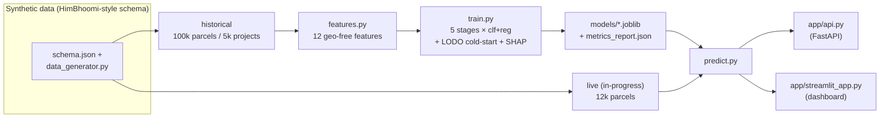

# SIH26017 — Predictive Analytics for Early Detection of Land Acquisition Delays

An AI-powered **early-warning system** that predicts which land-acquisition projects will
get delayed, *before* the delay happens — built for Ministry of Rural Development problem
statement **SIH26017** under the **RFCTLARR Act, 2013**.

For each parcel (rolled up to project → village → district → state) it outputs a **risk
score**, a **per-stage delay probability**, **explainable contributing factors** (SHAP),
and **recommended corrective actions**.

> ⚠️ Any collaborator/AI: read [`PROJECT_CONTEXT.md`](PROJECT_CONTEXT.md) first — it is the
> authoritative decision log.

---

## 1. Problem

Land acquisition is the most time-sensitive phase of infrastructure delivery. Delays stem
from many interacting causes — administrative approvals, legal disputes, compensation
disbursement, incomplete documentation, ownership conflicts, and rehabilitation &
resettlement. There is currently **no intelligent mechanism to flag a project *before* it
falls behind**, so monitoring is reactive.

## 2. Solution

A machine-learning pipeline that learns from **historical land records + RFCTLARR stage
timelines** to score risk per parcel:

- **5 legal stages** (SIA, Notification, Declaration, Award, Possession), each with a
  statutory clock. Delay = actual days − statutory days.
- **10 models** (5 stages × classifier + regressor) predict per-stage delay probability
  and days-overrun.
- **Region-agnostic by design** — models never see district/state names, so a brand-new
  district is scored instantly via feature similarity (cold-start).
- **Explainable** (SHAP) + **actionable** (rule-based recommendations).

## 3. Architecture



```
            ┌────────────────────────────────────────────────────┐
            │  schema.json  →  data_generator.py (seeded, rule)  │
            └───────────────┬────────────────────┬───────────────┘
                historical 100k parcels        live 12k parcels
                            │                    │
                            ▼                    │
                     features.py (geo-free X)   │
                            │                    │
                     train.py (10 models, LODO)  │
                            │                    │
                     models/*.joblib ────────────┼──┐
                                                 ▼  │
                                       predict.py ◄─┘
                                      ┌───────┴───────┐
                                      ▼               ▼
                                  app/api.py     app/streamlit_app.py
                                  (FastAPI)      (dashboard: risk table,
                                                  per-stage bars, SHAP,
                                                  actions, what-if, alerts,
                                                  offline map, roles)
```

## 4. Tech stack

Python 3.14 · pandas · NumPy · scikit-learn (HistGradientBoosting) · SHAP · Streamlit ·
Plotly (offline risk map) · FastAPI/uvicorn · joblib · parquet.

## 5. Results (current run — regenerate with `src/demo_numbers.py`)

Per-stage classifier AUROC (in-sample 80/20) and cold-start drop (leave-one-district-out):

| Stage | AUROC | delay rate | cold-start drop |
|---|---|---|---|
| SIA | 0.763 | 59% | −3.9% |
| NOTIFICATION | 0.859 | 77% | −3.0% |
| DECLARATION | 0.910 | 87% | −1.3% |
| AWARD | 0.906 | 75% | −0.6% |
| POSSESSION | 0.914 | 73% | −0.7% |

- **Cold-start proof:** trained on 11 districts, the model still predicts the held-out
  12th within ~1–4% of in-sample accuracy → region-agnostic by design.
- **District risk ranking** (area-weighted): worst **Mandi 0.64** … best **Sirmaur 0.40**.
- **~25%** of in-progress stages are already past their statutory deadline
  (overrun-while-ongoing — the early-warning "money shot").
- Full metrics: `models/metrics_report.json`.

## 6. Setup & run

```bash
# one-command setup from a fresh clone (creates venv, installs, regenerates data+models)
bash scripts/bootstrap.sh --no-launch   # add no flag to also launch the dashboard

# or run pieces manually (with .venv activated)
.venv/bin/python src/data_generator.py        # 1. data
.venv/bin/python src/sanity_check.py          #    sanity
.venv/bin/python src/train.py                 # 2. models (+ LODO + SHAP)
.venv/bin/python src/predict.py --refresh-portfolio   # 3. live portfolio cache
.venv/bin/streamlit run app/streamlit_app.py  # 4. dashboard (http://localhost:8501)
.venv/bin/uvicorn app.api:app --port 8000     #    API (http://localhost:8000/docs)
```

**Other entry points**

```bash
.venv/bin/python src/predict.py --parcel-id PRCL_0000006   # score one parcel (JSON)
.venv/bin/python src/predict.py --json parcel.json         # score from a JSON file
.venv/bin/python src/demo_numbers.py                       # demo facts (auto-sourced)
.venv/bin/python src/e2e_test.py                           # end-to-end gate (incl. fresh clone)
```

The API contract is documented in [`INTERFACES.md`](INTERFACES.md).

## 7. Demo

The 90-second scripted walkthrough is in [`DEMO_SCRIPT.md`](DEMO_SCRIPT.md). The headline
flow: district risk table → parcel detail with per-stage bars → SHAP "why" → recommended
actions → **what-if** ("clear the court stay" drops a RED parcel to GREEN live) → offline
district hotspot map → alerts feed → API + role-switcher.

## 8. Data & cold-start defense (the honest framing)

- Data is **synthetic** but mirrors real HimBhoomi schemas; delay rules encode documented
  ground realities (joint owners → consent delays; court stay → award freeze; orchard →
  compensation disputes).
- NIC/gov data access requires approval beyond student scope; the **architecture is
  production-ready** once access is granted ("plug in Bhoomi/Bhulekh data").
- Cold-start is validated, not asserted: leave-one-district-out shows the model
  generalizes to unseen districts, with a small believable drop driven by a **hidden
  district-level confound** (admin capacity) that is only partially proxied by features.

## 9. Limitations & future work

- `train.py --incremental` is a **refit-on-new-data** path (HistGradientBoosting has no
  true `partial_fit`) — it is *not* online learning.
- Role-based access is a **mock** (UI-only gating); real RBAC + audit trails are deferred.
- Map is an offline lat/lon scatter (no GIS tile server), chosen for offline reliability.
- Live NIC/Bhulekh integration, real GIS, and notification transport are production
  extensions.

## 10. Repo layout

```
sih-land-delay/
├── PROJECT_CONTEXT.md      ← decision log (read first)
├── README.md               ← this file
├── INTERFACES.md           ← prediction contract + API spec
├── DEMO_SCRIPT.md          ← 90-second walkthrough
├── schema.json             ← land record + lifecycle column definitions
├── requirements.txt
├── scripts/bootstrap.sh    ← fresh-clone one-command setup
├── data/generated/         ← synthetic data + portfolio cache (parquet)
├── models/                 ← 10 trained models + SHAP + metrics report
├── src/
│   ├── data_generator.py   ├── sanity_check.py   ├── features.py
│   ├── train.py            ├── predict.py        ├── actions.py
│   ├── demo_numbers.py     └── e2e_test.py
└── app/
    ├── streamlit_app.py    └── api.py
```

## 11. Verification

`src/e2e_test.py` (25 checks) proves the whole pipeline end-to-end, including a
**fresh-clone bootstrap** — copying only the source and re-running `bootstrap.sh`
regenerates a working demo.
